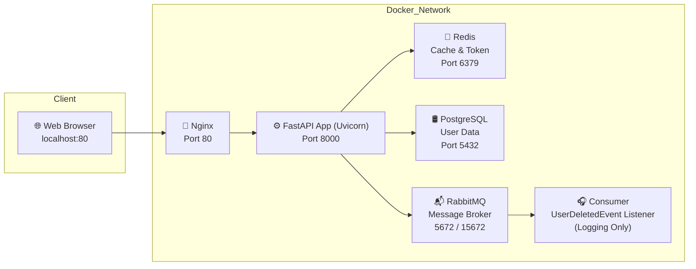

## 📘 fastapi-auth

FastAPI 기반 사용자 인증 및 관리 서비스입니다.  
JWT 기반 로그인, 사용자 등록/조회/삭제 기능과 Redis 캐시드 및 RabbitMQ 이벤트 발행 구조를 가지고 있습니다.

---

## 📁 프로젝트 구조

```
fastapi-auth/
├── alembic/                    # DB 마이그레이션 설정
│   ├── env.py                  # Alembic 환경 설정 스크립트
│   └── versions/
│       └── 9e6637e6b059_create_users_and_roles_tables.py  # 테이블(users, roles) 및 가데이터, 인덱스 생성
├── app/
│   ├── main.py                 # FastAPI 진입점
│   ├── common/                 # 설정, 예외, 로거, 유틸리티, 보안, Redis
│   ├── controller/             # 라우터 컨트롤러 정의 (auth, user)
│   ├── db/                     # DB 세션 및 모델 정의
│       └── models/             # SQLAlchemy 모델(Entity)
│   ├── domain/                 # Pydantic 스키마 및 Enum 정의
│   ├── event/                  # RabbitMQ 설정
│       └── user_event/         # 유저 이벤트 처리
│   ├── repository/             # 추상화된 레포지토리 인터페이스
│       └── persistence/        # 실제 DB 접근 구현
│   └── service/                # 비즈니스 로직 서비스
├── tests/                      # 서비스 단위 테스트 모음
│   ├── auth/                   # 인증 관련 테스트
│   └── user/                   # 사용자 관련 테스트
├── scripts/                    # 테스트 실행 및 서비스 대기 스크립트
├── nginx/                      # Nginx 설정 및 Dockerfile
├── .env.dev                    # 개발용 환경 변수 설정 파일
├── .gitignore                  # Git에 포함되지 않을 파일/디렉토리 목록
├── Dockerfile                  # FastAPI 앱 빌드용 Dockerfile
├── README.md                   # 프로젝트 소개 및 설명 문서
├── README_API_SPEC.md          # API 명세서 문서
├── alembic.ini                 # Alembic 설정 파일
├── docker-compose.yml          # 전체 서비스 실행 정의
├── pytest.ini                  # Pytest 설정 파일
├── requirements.txt            # Python 의존성 명세
└── test_main.http              # API 테스트 시나리오 (REST Client)
```

---

## ✅ 전체 서비스 아키텍처

`docker-compose.yml` 기반으로 구성된 **전체 서비스 아키텍처 Mermaid 다이어그램**입니다:



### 🧩 설명

- **Client**: REST Client, Swagger UI 등 API를 호출하는 클라이언트
- **Nginx**: 80 포트를 통해 FastAPI 서비스에 reverse proxy
- **FastAPI (Backend)**: main API 서버, DB/Redis/RabbitMQ와 직접 통신
- **Consumer**: 사용자 삭제 이벤트를 비동기적으로 RabbitMQ에서 수신하여 처리
- **Redis**: 캐시 저장소
- **PostgreSQL**: 사용자 및 역할 데이터를 저장하는 관계형 데이터베이스
- **RabbitMQ**: 이벤트 발행 및 소비를 위한 메시지 브로커

---

## 🚀 프로젝트 실행 방법 (Docker Compose)

```
# 빌드 및 실행
$ docker-compose up --build
```

접속 주소: [http://localhost](http://localhost/)

---

## 🛠️ 사용된 기술 스택 및 라이브러리

| 기술 | 역할 | 설명 |
| --- | --- | --- |
| FastAPI | 웹 프레임워크 | 비동기 지원, 자동 Swagger 문서화 |
| SQLAlchemy | ORM | 비동기 지원, 복사한 퀴리 작성 가능 |
| Alembic | DB 마이그레이션 | 명시적 schema 버전 관리 |
| PostgreSQL | RDB | 사용자 및 역할 데이터 저장 |
| Redis | 캐시 저장소 | 사용자 조회 결과 캐시드 |
| JWT | 인증 토큰 | Stateless 인증 처리 |
| RabbitMQ | 메시지 브로커 | 사용자 삭제 이벤트 발행 처리 |
| Pytest | 테스트 프레임워크 | 단위 테스트 기반 검증 |
| Docker | 커테이너 실행 환경 | 로커 및 배포 환경 통합 |

---

## 📂 테스트

- 전체 테스트는 총 **4개 파일**로 구성되어 있으며, `pytest` 기반의 단위 테스트 및 서비스 계층 모킹 테스트를 포함합니다.
- `tests/auth/`, `tests/user/` 디렉토리로 도메인별 테스트가 분리되어 있으며, 서비스 단의 메서드 호출과 결과를 검증합니다.
- 실제 API 호출 테스트는 `test_main.http` 로 실행 가능합니다.

```
📁 tests/
├── auth/test_auth_service_with_mock.py
├── user/test_user_service_with_mock.py
└── user/test_user_service_with_mock_with_event.py
```

## 🧪 Docker 기반 테스트 실행 가이드

### ✅ 전제 조건

- FastAPI 서버는 Docker 컨테이너로 이미 실행 중
- 테스트 대상 API는 컨테이너 내에서 정상적으로 응답 중 (`http://localhost` 등)

---

### ✅ Docker 컨테이너 내부에서 테스트 실행

```python
# 컨테이너 이름 또는 ID 확인
$ docker ps

# 컨테이너 내부에서 pytest 실행
$ docker exec -it my_fastapi pytest tests/ -v
```

---

## 📐 회고

### ✅ 왜 FastAPI인가요? (vs Spring Boot)

- 한정된 시간 내에 빠르게 퍼포먼스를 입증하고자 FastAPI를 선택하게되었습니다.  
FastAPI는 `async/await` 기반의 비동기 처리, 자동 Swagger 문서화, 타입 기반 유효성 검증 등  
개발 생산성이 높다는 점에서 적합했습니다.

### ✅ 설계 패턴 및 아키텍처 원칙

- Service Layer, Repository Pattern, Domain-Schema 분리를 통해 유지보수성과 테스트 용이성을 높였습니다.
- FastAPI의 라우터는 `controller/`에 구성하고, 서비스 로직과 저장소 접근은 각각 `service/`, `repository/`로 나누어 책임을 명확히 구분했습니다.
- 예시:
    - `app/service/user_service.py`: 사용자 관련 비즈니스 로직 처리
    - `app/repository/user_repository.py`: 사용자 저장소 인터페이스 정의
    - `app/repository/persistence/user_repository_impl.py`: 실제 DB 연산 구현체
    - `app/domain/user/user_schema.py`: 요청/응답 및 내부 데이터 구조 정의 (Pydantic 기반)

이러한 계층 구조는 추후 로직 확장, 테스트 작성, 인프라 교체(PostgreSQL → MySQL 등) 시에도 최소한의 변경으로 대응할 수 있도록 설계되었습니다.


### 🏁 권한 설계

- 본 프로젝트는 API 접근 권한을 명확히 구분하기 위해 JWT 기반 인증(Authentication)과 역할(Role)에 따른 인가(Authorization) 로직을 별도 모듈로 구현했습니다.  
    - `get_current_user()`: JWT 토큰을 디코딩하여 현재 사용자 객체를 반환합니다.  
    - `admin_required()`: 관리자 역할을 가진 사용자만 접근 가능하도록 제한합니다.
    - `self_or_admin_required(user_id)`: 본인이거나 관리자일 경우만 접근을 허용합니다.
- 이러한 권한 검증은 FastAPI의 `Depends()`를 활용해 각 API 엔드포인트에 유연하게 주입되며, 실수로 권한이 없는 사용자에게 민감한 기능이 노출되지 않도록 방지합니다.


### 🎯 DB 및 메시지 큐 설계

- PostgreSQL, Redis, RabbitMQ는 모두 `docker-compose.yml`에 정의되어 있어 별도의 설치 없이 로컬 개발 환경에서 실행 가능합니다.
- Alembic을 통해 마이그레이션 되며 다음과 같은 데이터가 자동 생성됩니다:
    - `roles` 테이블: Admin / Member 역할 이름과 설명, 생성/수정 시각, soft delete 필드 포함
    - `users` 테이블: 이메일, 비밀번호, 이름, 역할 ID (FK), 활성화 여부, 생성/수정 시각, soft delete 필드 포함
    - `admin@example.com` 계정이 초기 생성되며, 기본 비밀번호는 `admin1234`로 bcrypt 해시된 상태로 저장됩니다.
- 사용자와 역할을 분리한 RBAC 구조를 적용하고, Alembic 기반 마이그레이션을 통해 스키마 이력을 명시적으로 관리합니다.

### ✴️ 쿼리 최적화 전략

- `UserService` 에서는 Redis 캐시를 적극 활용하여 사용자 단건 조회 및 사용자 목록 조회 결과를 임시 저장하고 있습니다.
    - `get_user()`: 사용자 정보가 Redis에 있을 경우 DB 접근 없이 반환하며, 조회 실패 시 DB에서 가져와 캐싱합니다.
    - `get_users()`: 요청 파라미터에 기반한 해시 키로 Redis 캐시를 구성하여 목록 데이터를 저장하고, 수정/삭제 시 캐시 무효화를 수행합니다.
- `UserRepositoryImpl` 에서는 N+1 문제를 방지하기 위해 `selectinload(User.role)` 옵션을 일관되게 사용하고 있습니다.
- 사용자 수를 세는 `count_users()` 쿼리는 `select(...).subquery()` 구조로 작성되어 성능을 고려한 형태입니다.

Alembic 마이그레이션을 통해 `users` 테이블에는 다음과 같은 인덱스가 미리 정의되어 있습니다:

- `idx_users_email`
- `idx_users_name`
- `idx_users_role_id`
- `idx_users_is_active`
- `idx_users_created_at`

이를 통해 정렬, 필터링, 검색 성능을 일정 수준 보장할 수 있습니다. 
다만, 고급 동적 필터링이나 다중 컬럼 복합 인덱스 전략은 요구 사항에 포함되어 있지 않아, 
트래픽 증가나 복잡한 쿼리에 대비한 추가 최적화는 과제로 남아 있습니다. 

### ⚙️ 비동기 이벤트 처리 (RabbitMQ)

- 사용자의 탈퇴는 단순 삭제(DB 비활성화)로 끝나지 않고, **RabbitMQ를 통해 이벤트가 발행**됩니다.
- `UserService.delete_user()` 내부에서 `publish_user_deleted(user_id)` 함수를 호출하여 메시지를 발행합니다.

```python
# app/service/user_service.py
await publish_user_deleted(user.id)
```

- 이 이벤트는 `user_consumer_runner.py`를 통해 실행된 consumer가 수신하고,
- `user_consumer_handler.py`에서는 다음과 같이 로그를 출력합니다:

```python
# app/event/user_event/user_consumer_handler.py
logger.info(f"[CONSUMER] 사용자 탈퇴 이벤트 수신: user_id={user_id}")
```

- 현재는 별도의 후속 작업은 구현되어 있지 않으며, 로그 기록만 수행합니다.
- 향후 다음과 같은 작업을 추가하기 쉽게 확장 가능한 구조로 설계되어 있습니다:
    - 탈퇴 확인 이메일 발송
    - 사용자 데이터 백업
    - 외부 API 연동 및 클린업 작업 등

이러한 기술 선택과 설계 결정은 프로젝트를 빠르게 실행하면서도 확장성과 유지보수성을 확보하기 위한 고민의 결과입니다.  
다음은 실제 개발 과정에서 마주한 문제와 그 해결 방식입니다.

---

## 🧩 개발 과정에서의 문제 해결 사례

- **의존 서비스 연결 순서 문제**:
  - PostgreSQL, Redis, RabbitMQ가 완전히 실행되기 전 FastAPI 서버가 먼저 실행되는 문제를 `wait-for-*.sh` 스크립트로 해결했습니다.
- **도메인 분리**:
  - 기능이 커질 가능성을 고려하여 도메인 별로 `controller`, `service`, `repository`, `schema`를 구분하여 확장성과 가독성을 확보했습니다.
